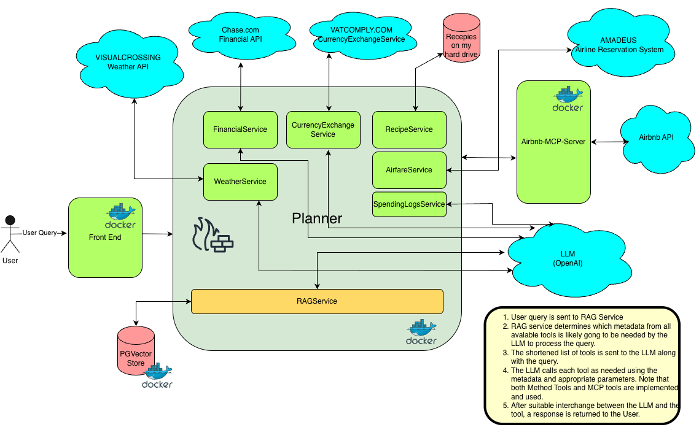
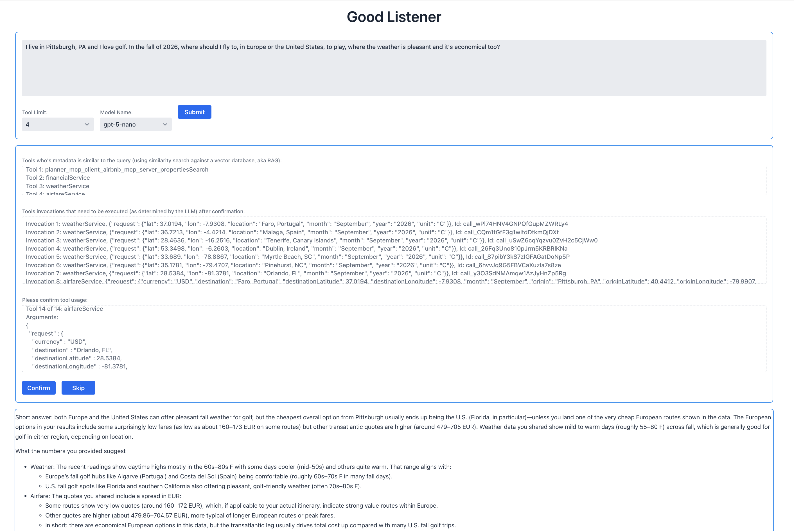
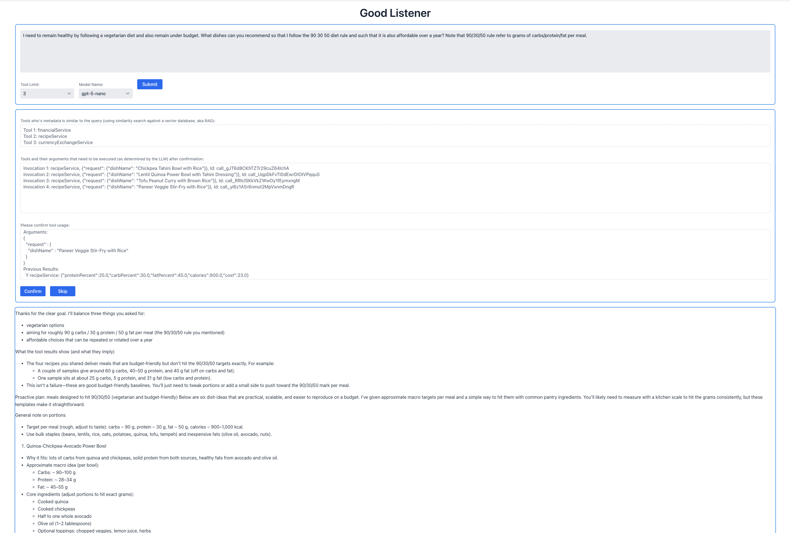
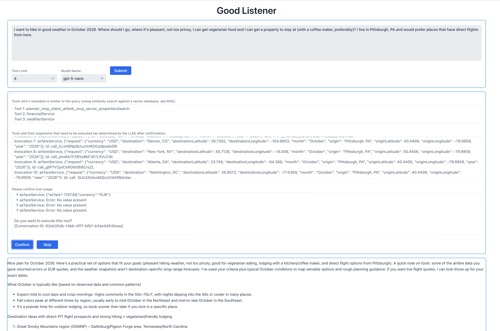

Planner
===

This project demonstrates how we can use Spring AI's implementation of the `Tool Calling` feature along with `Retrieval Augumented Generation` (RAG) so that we can not only interact 
with pre-trained models in a secure manner, we can also minimize the 
tokens of function metadata sent to the LLMs. It also demonstrates how to interact with a standalone MCP server.

These are sample questions that this app can answer, by combining Tool Calling (local and MCP) and RAG:
```
Q1. I live in Pittsburgh, PA and I love golf. In the fall of 2026, where should I fly to, in Europe or the United States, to play, where the weather is pleasant and it's economical too?

Q2. I need to remain healthy by following a vegetarian diet and also remain under budget. What dishes can you recommend so that I follow the 90 30 50 diet rule and such that it is also affordable over a year? Note that 90/30/50 rule refer to grams of carbs/protein/fat per meal.

Q3: I want to hike in good weather in October 2026. Where should I go, where it's pleasant, not too pricey, I can get vegetarian food and I can get a property to stay at (with a coffee maker, preferably)? I live in Pittsburgh, PA and would prefer places that have direct flights from here.

Q4. Based on my past spending habits, what are going to be my largest expenses in this quarter? 
```




#### Components of the app
This app consists of:
- **Planner** - This is a Spring Boot app that runs on port and exposes an endpoint that interacts with LLMs for inference and embeddings using Spring AI integration. It also contains services (@Service), some of which define metadata and can be exposed as Tools for the LLM to invoke when appropriate. (https://github.com/pankajtandon/vacationplanner) This runs in a Docker container.
- **Airbnb MCP server** - This is a Spring Boot app that implements an MCP server and exposes a service via the MCP protocol. (https://github.com/pankajtandon/airbnb-mcp-server). This runs in a Docker container.
- **A Postgres Vector db** - OOB image used to store embeddings of the query and Tool metadata during the RAG phase. This runs in Docker.
- **Good Listener UI** - This is a Vaadin frontend that accepts queries and displays responses. (https://github.com/pankajtandon/airbnb-mcp-server) Also runs in Docker.

These 4 components are orchestrated using a docker-compose file (https://github.com/pankajtandon/vacationplanner/blob/main/docker-compose.yml).

#### Running the app locally

Create the following environment variables in your .zshrc/bashrc:

```
export OPENAI_API_KEY=[api key (Create at https://platform.openai.com/api-keys)]
export VISUALCROSSING_API_KEY=[api key (Create at https://www.visualcrossing.com/account)]
export AMADEUS_CLIENT_ID=[api client Id (Create at https://www.accounts.amadeus.com/)]
export AMADEUS_CLIENT_SECRET=[api client secret (Create at https://www.accounts.amadeus.com/)]
```

- Checkout: https://github.com/pankajtandon/vacationplanner to PLANNER_ROOT
- Checkout: https://github.com/pankajtandon/airbnb-mcp-server to MCP_ROOT
- Checkout https://github.com/pankajtandon/good-listener to LISTENER_ROOT
 
```agsl
export PLANNER_ROOT=[/path/to/where/you/checkout/project]
export MCP_ROOT=[/path/to/where/you/checkout/project]
export LISTENER_ROOT=[/path/to/where/you/checkout/project]

```
- Install `mvn` and Java 21
- Install docker on your machine and make sure that the daemon process is running 
(`docker ps -a` should show the headings (at least) of a table listing running containers). 
- Navigate to the MCP_ROOT and run `mvn clean install`. This will build your project and place a jar file in the target dir.
- Navigate to LISTENER_ROOT and run `mvn clean install -Pproduction`. This will build your project and place a jar file in the target dir.
- Navigate to PLANNER_ROOT and run `mvn clean install`. This will build your project and place a jar file in the target dir.

To run the app and all related containers, navigate to PLANNER_HOME and first build the Docker images of all services:
```agsl
docker compose -f ${PLANNER_ROOT}/docker-compose.yml build
```
Next run all the apps:
```agsl
docker compose -f ${PLANNER_ROOT}/docker-compose.yml up
```

or, if you are in $PLANNER_ROOT, simply run
```arm
docker compose up
```

If you prefer to use mvn, from $PLANNER_ROOT, you can also run because the project is configured with the `spring-boot-docker-compose` plugin that uses the `docker-compose.yml` file:
```agsl
./mvnw spring-boot:run -Dspring-boot.run.jvmArguments='-Dspring.ai.openai.apiKey=${OPENAI_API_KEY} -Dweather.visualcrossing.apiKey=${VISUALCROSSING_API_KEY} -Dflight.amadeus.client-id=${AMADEUS_CLIENT_ID} -Dflight.amadeus.client-secret=${AMADEUS_CLIENT_SECRET}'
```

When the app is ready to receive traffic, go to http://localhost:8070 and ask your question!

At this point, the following docker instances should be running:

```
e8b88527d00b   vacationplanner-planner      "java -jar /app.jar"     17 minutes ago   Up 11 seconds   0.0.0.0:5005->5005/tcp, 0.0.0.0:8080->8080/tcp   vacationplanner-planner-1
c7b4d2d0e951   pgvector/pgvector:pg16       "docker-entrypoint.s…"   17 minutes ago   Up 11 seconds   0.0.0.0:5432->5432/tcp                           vacationplanner-db-1
0241bf8791f4   vacationplanner-ui           "java -Dvaadin.produ…"   17 minutes ago   Up 11 seconds   0.0.0.0:8070->8070/tcp                           vacationplanner-ui-1
d58885f68ce8   vacationplanner-mcp-airbnb   "java -jar /app.jar"     17 minutes ago   Up 11 seconds   0.0.0.0:8090->8090/tcp                           vacationplanner-mcp-airbnb-1
```

### MCP Server and Tool Calling:
This application accesses two kinds of tools:
- MethodTools that are annotated using the @Tool annotation and are defined in the application context
- MCPServerTools: A spring-ai based MCP server that receives requests on port 8090


### Screen shots
Here are some screen shots of the UI. Note the differnce between the RAG based selection of tools vs the tools that the LLM invokes in each of these interactions:
1. 

2.

3.


Thus, we have combined the powerful Tool calling feature with the RAG technique in this application.
