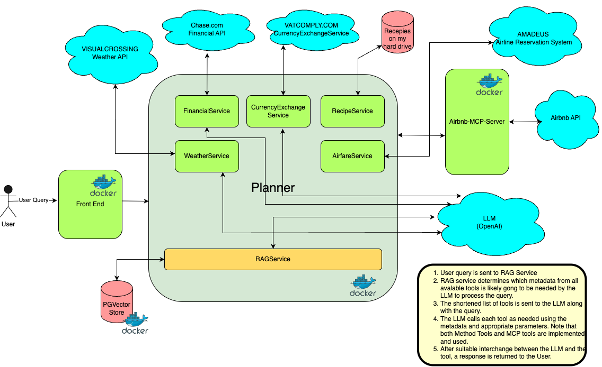

Planner
===

This project demonstrates how we can use
Spring AI's implementation of OpenAI's Tool Calling feature along with Retrieval Augumented Generation (RAG) so that we can not only interact 
with pre-trained models in a secure manner, we can also minimize the 
tokens of function metadata sent to the LLMs. It also demonstrates how to interact with a standalone MCP server.

These are sample questions that this app can answer, by combining Tool Calling (local and MCP) and RAG:
```
Q1. I live in Pittsburgh, PA and I love golf.
In the fall of 2024, where should I fly to, in Europe or the United States, to play, 
where the weather is pleasant and it's economical too?

Q2. I need to remain healthy by following a vegetarian diet and also remain under
budget. What dishes can you recommend so that I follow the 
90 30 50 diet rule and such that it is also affordable over a year?

Q3: I want to hike in good weather in October 2025. Where should I go, where it's pleasant, not too pricey, I can get 
good vegetarian food and I can get a good property to stay at (with a coffee maker, preferably)? 
I live in Pittsburgh, PA and would prefer places that have direct flights from here. Please use all the tools you 
have available to arrive at the answer. Also tell me which tools you used.
```




#### Components of the app
This app consists of:
- VacationPlanner - This is a Spring Boot app that runs on port and exposes an endpoint that interacts with LLMs for inference and embeddings using Spring AI integration. It also contains services (@Service), some of which define metadata and can be exposed as Tools for the LLM to invoke when appropriate.
- Airbnb MCP server - This is a Spring Boot app that implements a MCP server and exposes a service via the MCP protocol. (https://github.com/pankajtandon/airbnb-mcp-server). This runs in a Docker container.
- A Postgres Vector db - Used to store embeddings of the query and Tool metadata during the RAG phase. This runs in Docker.
- Good Listener UI - This is a Vaadin frontend that accepts queries and displays responses. Also runs in Docker.

These 4 components are orchestrated using a docker-compose file (https://github.com/pankajtandon/vacationplanner/blob/main/docker-compose.yml).

#### Running the app

Create the following environment variables in your .zshrc/bashrc:

```
export OPENAI_API_KEY=[api key (Create at https://platform.openai.com/api-keys)]
export VIRTUALCROSSING_API_KEY=[api key (Create at https://www.visualcrossing.com/account)]
export AMADEUS_CLIENT_ID=[api client Id (Create at https://www.accounts.amadeus.com/)]
export AMADEUS_CLIENT_SECRET=[api client secret (Create at https://www.accounts.amadeus.com/)]
```

- Checkout: https://github.com/pankajtandon/vacationplanner to PLANNER_ROOT
- Checkout: https://github.com/pankajtandon/airbnb-mcp-server to MCP_ROOT
- Checkout https://github.com/pankajtandon/good-listener to LISTENER_ROOT
 
```agsl
export PLANNER_ROOT=[/path/to/where/you/checkout/project]
export MCP_ROOT=[/path/to/where/you/checkout/project]
export LISTENER_ROOT=[/path/to/where/you/checkout/project]

```
- Install `mvn` and Java 17
- Install docker on your machine and make sure that the daemon process is running 
(`docker ps -a` should show the headings (at least) of a table listing running containers). 
- Navigate to the MCP_HOME and run `mvn clean install`. This will build your project and place a jar file in the target dir.
- Navigate to LISTENER_HOME and run `mvn clean install -Pproduction`. This will build your project and place a jar file in the target dir.
- Navigate to PLANNER_HOME and run `mvn clean install`. This will build your project and place a jar file in the target dir.

To run the app:
```agsl
docker compose up
```
You can also run:
```agsl
./mvnw spring-boot:run -Dspring-boot.run.jvmArguments='-Dspring.ai.openai.apiKey=${OPENAI_API_KEY} -Dweather.visualcrossing.apiKey=${VISUALCROSSING_API_KEY} -Dflight.amadeus.client-id=${AMADEUS_CLIENT_ID} -Dflight.amadeus.client-secret=${AMADEUS_CLIENT_SECRET}'
```

When the app is ready to receive traffic, go to http://localhost:8070 and ask your question!

Since we are not streaming (yet), it may be a while before the response shows up in the reponse box on the screen. 
The log output looks like this.

```
  .   ____          _            __ _ _
 /\\ / ___'_ __ _ _(_)_ __  __ _ \ \ \ \
( ( )\___ | '_ | '_| | '_ \/ _` | \ \ \ \
 \\/  ___)| |_)| | | | | || (_| |  ) ) ) )
  '  |____| .__|_| |_|_| |_\__, | / / / /
 =========|_|==============|___/=/_/_/_/

 :: Spring Boot ::                (v3.3.0)

20240710T085833.785 INFO  [main] o.s.b.StartupInfoLogger {} Starting VacationplannerApplication using Java 17.0.7 with PID 52397 (/Users/pankaj/myProjects/ml/vacationplanner/target/classes started by pankaj in /Users/pankaj/myProjects/ml/vacationplanner)
20240710T085833.791 DEBUG [main] o.s.b.StartupInfoLogger {} Running with Spring Boot v3.3.0, Spring v6.1.8
20240710T085833.792 INFO  [main] o.s.b.SpringApplication {} No active profile set, falling back to 1 default profile: "default"
20240710T085833.976 INFO  [main] o.s.b.d.c.l.DockerComposeLifecycleManager {} Using Docker Compose file '/Users/pankaj/myProjects/ml/vacationplanner/docker-compose.yml'
20240710T085834.803 INFO  [OutputReader-stderr] o.s.b.l.LogLevel {}  Container es01  Created
20240710T085834.803 INFO  [OutputReader-stderr] o.s.b.l.LogLevel {}  Container kib01  Created
20240710T085834.808 INFO  [OutputReader-stderr] o.s.b.l.LogLevel {}  Container kib01  Starting
20240710T085834.808 INFO  [OutputReader-stderr] o.s.b.l.LogLevel {}  Container es01  Starting
20240710T085835.079 INFO  [OutputReader-stderr] o.s.b.l.LogLevel {}  Container es01  Started
20240710T085835.104 INFO  [OutputReader-stderr] o.s.b.l.LogLevel {}  Container kib01  Started
20240710T085835.105 INFO  [OutputReader-stderr] o.s.b.l.LogLevel {}  Container es01  Waiting
20240710T085835.105 INFO  [OutputReader-stderr] o.s.b.l.LogLevel {}  Container kib01  Waiting
20240710T085835.610 INFO  [OutputReader-stderr] o.s.b.l.LogLevel {}  Container kib01  Healthy
20240710T085835.611 INFO  [OutputReader-stderr] o.s.b.l.LogLevel {}  Container es01  Healthy
20240710T085856.045 INFO  [main] o.s.b.w.e.t.TomcatWebServer {} Tomcat initialized with port 8080 (http)
20240710T085856.053 INFO  [main] o.a.j.l.DirectJDKLog {} Initializing ProtocolHandler ["http-nio-8080"]
20240710T085856.054 INFO  [main] o.a.j.l.DirectJDKLog {} Starting service [Tomcat]
20240710T085856.054 INFO  [main] o.a.j.l.DirectJDKLog {} Starting Servlet engine: [Apache Tomcat/10.1.24]
20240710T085856.092 INFO  [main] o.a.j.l.DirectJDKLog {} Initializing Spring embedded WebApplicationContext
20240710T085856.094 INFO  [main] o.s.b.w.s.c.ServletWebServerApplicationContext {} Root WebApplicationContext: initialization completed in 887 ms
20240710T085856.963 INFO  [main] o.s.b.a.w.s.WelcomePageHandlerMapping {} Adding welcome page: class path resource [static/index.html]
20240710T085857.457 INFO  [main] o.s.b.a.e.w.EndpointLinksResolver {} Exposing 15 endpoints beneath base path '/actuator'
20240710T085857.514 INFO  [main] o.a.j.l.DirectJDKLog {} Starting ProtocolHandler ["http-nio-8080"]
20240710T085857.526 INFO  [main] o.s.b.w.e.t.TomcatWebServer {} Tomcat started on port 8080 (http) with context path '/planner'
20240710T085857.562 INFO  [main] o.s.b.StartupInfoLogger {} Started VacationplannerApplication in 24.029 seconds (process running for 25.268)
```
#### Interacting with the Webapp:
```
curl -H "content-type: application/json" -X GET http://localhost:8080/planner/query -d '{"userQuery": "I live in Pittsburgh, PA and I love golf. In the fall of 2024, where should I fly to, in Europe or the United States, to play, where the weather is pleasant and it'\''s economical too?", "userSuppliedTopKFunctions": 4}'
```

The second parameter in the JSON payload (`userSuppliedTopKFunctions`) is optional and represents the number of functions' metadata that the application should send to the LLM based on the query asked. The higher the number, the more metadata is sent to the LLM and the more tokens will be spent.
If it is not specified, the value used is in the property `rag.topK`.


#### Sample output
Below is sample output that has been produced by the run of the above using OpenAI:

The question asked is:

```
I live in Pittsburgh, PA and I love golf. In the fall of 2024, where should I fly to, in Europe or the United States, to play, where the weather is pleasant and it's economical too?
```

Here is the response from OpenAI's GPT LLM after it has gathered information from the custom supplied functions.
```
Based on the weather and airfare for October 2024, here are your options for playing golf in pleasant weather conditions, also considering the cost efficiency:

1. **San Francisco, CA**
   - Weather: Average temp of 60.5°F, with a range between 54.7°F and 68.8°F.
   - Airfare: Approximately $168.73 USD.

2. **Phoenix, AZ**
   - Weather: Average temp of 77.1°F, with a range between 66.0°F and 88.2°F.
   - Airfare: Approximately $176.83 USD.

3. **Lisbon, Portugal**
   - Weather: Average temp of 65.6°F, with a range between 60.1°F and 72.9°F.
   - Airfare: Approximately $524.20 USD.

4. **Barcelona, Spain**
   - Weather: Average temp of 64.9°F, with a range between 57.8°F and 71.9°F.
   - Airfare: Approximately $420.64 USD.

Considering both the pleasantness of the weather and the economic aspect, **Phoenix, AZ** offers the warmest temperatures ideal for golf, with a slightly higher but still reasonable airfare compared to San Francisco. However, if you prefer slightly cooler and more moderate temperatures, **San Francisco, CA** is the most economical and pleasant option among the locations evaluated. European destinations, while offering pleasant temperatures, are significantly more expensive in terms of airfare.
```

#### What's happening under the covers:

Looking at the logs, we can see the following:

```
20240710T101521.522 INFO  [http-nio-8080-exec-3] c.t.a.v.s.RagService {} There were 5 ragCandidate beans defined in the context out of which 0 were vectorized and inserted into the vectorStore (possibly because they already existed in vector store)
20240710T101521.750 INFO  [http-nio-8080-exec-3] c.t.a.v.s.RagService {} There were 4 functions found that were relevant to the passed in query, with a distance range from 0.6414833 to 0.7153696
20240710T101521.751 DEBUG [http-nio-8080-exec-3] c.t.a.v.s.RagService {} Functions metadata being sent to LLM in descending order of relevance: [financialService, airfareService, weatherService, currencyExchangeService]
20240710T101529.608 INFO  [http-nio-8080-exec-3] c.t.a.v.s.WeatherService {} Called WeatherService with request: Request[location=San Francisco, CA, lat=37.7749, lon=-122.4194, unit=F, month=October, year=2024]
20240710T101529.853 INFO  [http-nio-8080-exec-3] c.t.a.v.s.WeatherService {} WeatherService returned: Response[temp=60.5, temp_min=54.722580645161294, temp_max=68.75161290322582, unit=F]
20240710T101529.854 INFO  [http-nio-8080-exec-3] c.t.a.v.s.WeatherService {} Called WeatherService with request: Request[location=Phoenix, AZ, lat=33.4484, lon=-112.074, unit=F, month=October, year=2024]
20240710T101529.958 INFO  [http-nio-8080-exec-3] c.t.a.v.s.WeatherService {} WeatherService returned: Response[temp=77.0516129032258, temp_min=66.04838709677419, temp_max=88.2290322580645, unit=F]
20240710T101529.958 INFO  [http-nio-8080-exec-3] c.t.a.v.s.WeatherService {} Called WeatherService with request: Request[location=Lisbon, Portugal, lat=38.7223, lon=-9.1393, unit=F, month=October, year=2024]
20240710T101530.056 INFO  [http-nio-8080-exec-3] c.t.a.v.s.WeatherService {} WeatherService returned: Response[temp=65.5741935483871, temp_min=60.12903225806452, temp_max=72.92903225806452, unit=F]
20240710T101530.057 INFO  [http-nio-8080-exec-3] c.t.a.v.s.WeatherService {} Called WeatherService with request: Request[location=Barcelona, Spain, lat=41.3851, lon=2.1734, unit=F, month=October, year=2024]
20240710T101530.157 INFO  [http-nio-8080-exec-3] c.t.a.v.s.WeatherService {} WeatherService returned: Response[temp=64.94516129032257, temp_min=57.83548387096774, temp_max=71.9483870967742, unit=F]
20240710T101541.870 INFO  [http-nio-8080-exec-3] c.t.a.v.s.AirfareService {} Called AirfareService with Request[origin=Pittsburgh, PA, destination=San Francisco, CA, currency=USD, originLatitude=40.4406, originLongitude=-79.9959, destinationLatitude=37.7749, destinationLongitude=-122.4194, month=October, year=2024]
20240710T101548.601 INFO  [http-nio-8080-exec-3] c.t.a.v.s.AirfareService {} AirfareService response: Response[airfare=156.97, currency=EUR]
20240710T101548.603 INFO  [http-nio-8080-exec-3] c.t.a.v.s.AirfareService {} Called AirfareService with Request[origin=Pittsburgh, PA, destination=Phoenix, AZ, currency=USD, originLatitude=40.4406, originLongitude=-79.9959, destinationLatitude=33.4484, destinationLongitude=-112.074, month=October, year=2024]
20240710T101551.854 INFO  [http-nio-8080-exec-3] c.t.a.v.s.AirfareService {} AirfareService response: Response[airfare=164.51, currency=EUR]
20240710T101551.855 INFO  [http-nio-8080-exec-3] c.t.a.v.s.AirfareService {} Called AirfareService with Request[origin=Pittsburgh, PA, destination=Lisbon, Portugal, currency=USD, originLatitude=40.4406, originLongitude=-79.9959, destinationLatitude=38.7223, destinationLongitude=-9.1393, month=October, year=2024]
20240710T101556.770 INFO  [http-nio-8080-exec-3] c.t.a.v.s.AirfareService {} AirfareService response: Response[airfare=487.67, currency=EUR]
20240710T101556.771 INFO  [http-nio-8080-exec-3] c.t.a.v.s.AirfareService {} Called AirfareService with Request[origin=Pittsburgh, PA, destination=Barcelona, Spain, currency=USD, originLatitude=40.4406, originLongitude=-79.9959, destinationLatitude=41.3851, destinationLongitude=2.1734, month=October, year=2024]
20240710T101604.980 INFO  [http-nio-8080-exec-3] c.t.a.v.s.AirfareService {} AirfareService response: Response[airfare=391.33, currency=EUR]
20240710T101610.690 INFO  [http-nio-8080-exec-3] c.t.a.v.s.CurrencyExchangeService {} Called CurrencyExchangeService with Request[amount=156.97, currencyIn=EUR, currencyOut=USD]
20240710T101611.180 INFO  [http-nio-8080-exec-3] c.t.a.v.s.CurrencyExchangeService {} CurrencyExchangeService response: Response[amount=168.72705299999998, currencyOut=USD]
20240710T101611.183 INFO  [http-nio-8080-exec-3] c.t.a.v.s.CurrencyExchangeService {} Called CurrencyExchangeService with Request[amount=164.51, currencyIn=EUR, currencyOut=USD]
20240710T101611.333 INFO  [http-nio-8080-exec-3] c.t.a.v.s.CurrencyExchangeService {} CurrencyExchangeService response: Response[amount=176.831799, currencyOut=USD]
20240710T101611.335 INFO  [http-nio-8080-exec-3] c.t.a.v.s.CurrencyExchangeService {} Called CurrencyExchangeService with Request[amount=487.67, currencyIn=EUR, currencyOut=USD]
20240710T101611.493 INFO  [http-nio-8080-exec-3] c.t.a.v.s.CurrencyExchangeService {} CurrencyExchangeService response: Response[amount=524.1964830000001, currencyOut=USD]
20240710T101611.494 INFO  [http-nio-8080-exec-3] c.t.a.v.s.CurrencyExchangeService {} Called CurrencyExchangeService with Request[amount=391.33, currencyIn=EUR, currencyOut=USD]
20240710T101611.646 INFO  [http-nio-8080-exec-3] c.t.a.v.s.CurrencyExchangeService {} CurrencyExchangeService response: Response[amount=420.64061699999996, currencyOut=USD]
20240710T101623.269 INFO  [http-nio-8080-exec-3] c.t.a.v.s.VacationService {} Returned a recommendation!
```
__Note__ that 4 functions' metadata are sent to the LLM and `RecipeService` metadata is _NOT_ sent to the LLM because it is not relevant to the query.
Also note the requests (along with parameter values) and responses from each of the 4 functions between the LLM and this application.


#### Adding a new service.

Because of the way Spring-AI has implemented function calling, adding a new service is extremely easy:

- Write a service that implements `Function<Request, Response>`. Or add this interface to an existing Spring managed service.
- Use the `WeatherService` as an example.
- Ensure that the @JsonClassDescription on the `Request` describes what this function does. (This constitutes the metadata sent to the LLM)
- Ensure that the @JsonPropertyDescription describes each input argument. (This constitutes the metadata sent to the LLM)
- The `apply` method of that service will take in a `Request` and return a `Response`. Implement it appropriately.
- If you would like to use the RAG feature where only the metadata of functions that are relevant to the query is sent to the LLM, 
ensure that the service is annotated with @RagCandidate.
- The Spring Boot application can contain services that do _not_ implement `Function<Request, Response>` or `RagCandidate`. 
- Note that the `Function<Request, Response>` interface and the `RagCandidate` annotation can be added to an existing
Spring service.
- Configure these services as is done in <code>FunctionCallingConfig</code>
- Invoke the <code>OpenAiChatClient</code> as is done in <code>VacationService</code>
- Specify the <code>apiKey</code> and the <code>model</code> in the appropriate `-D propertiers on the CLI` as 
  has been defined in the <code>application.yml</code> file.


#### Using RAG
Combining RAG with function calling helps in reducing the number of tokens 
that are sent to the LLM in the form of function metadata (which can also become large).

The overall idea is that your application can implement a
library of services (aka functions) that can be invoked
selectively by the LLM based on the query.

A second question that uses a different set of functions could be:

```
I need to remain healthy by following a vegetarian diet and also under budget. 
What dishes can you recommend so that I follow the 
90 30 50 diet rule and such that it is also affordable
over a year?
```

This returns the following recommendation:

```
Based on the nutritional content and cost details of the vegetarian dishes evaluated, here are some recommendations that align closely with the 90 30 50 diet rule and are budget-friendly over a year:

1. **Lentil Soup**
   - **Protein:** 25%
   - **Carbs:** 40%
   - **Fat:** 35%
   - **Calories:** 650
   - **Cost:** $20.5 per serving

2. **Quinoa and Black Beans**
   - **Protein:** 24%
   - **Carbs:** 26%
   - **Fat:** 50%
   - **Calories:** 750
   - **Cost:** $15.0 per serving

3. **Tofu Curry**
   - **Protein:** 24%
   - **Carbs:** 26%
   - **Fat:** 50%
   - **Calories:** 750
   - **Cost:** $15.0 per serving

While the "Quinoa and Black Beans" and "Tofu Curry" dishes closely adhere to the intended diet rule and are the most affordable options, you might need to adjust portions or incorporate low-cost supplementary items to meet exact macronutrient targets.

Given your monthly income is $1,000, and assuming other expenses allow, choosing cost-efficient meals like "Quinoa and Black Beans" or "Tofu Curry" could be sustainable. 

**Budget Analysis Over a Year:**

Assuming two servings per day for the sake of simplicity:
- Daily cost (for the most affordable options at $15.0 per serving): $30
- Monthly cost: $900
- Annual cost: $10,800

This seems to exceed your regular monthly income. However, with wise budgeting or considering a less strict adherence by mixing in more affordable ingredients or meals, you could manage to align your diet with your financial constraints more comfortably. 

Remember, variety in your diet is essential for health, so consider these dishes as part of a larger assortment of meals to ensure you're meeting all your nutritional needs without monotony.
```


And here is what is happening under the covers:

```
20240709T120831.175 INFO  [http-nio-8080-exec-2] c.t.a.v.s.RagService {} There were 5 ragCandidate beans defined in the context out of which 0 were vectorized and inserted into the vectorStore (probably because they already existed in the vector store)
20240709T120832.198 INFO  [http-nio-8080-exec-2] c.t.a.v.s.RagService {} There were 2 functions found that were relevant to the passed in query, with a distance range from 0.71621394 to 0.7551434
20240709T120832.199 DEBUG [http-nio-8080-exec-2] c.t.a.v.s.RagService {} Functions metadata being sent to LLM in descending order of relevance: [recipeService, financialService]
20240709T120834.637 INFO  [http-nio-8080-exec-2] c.t.a.v.s.FinancialService {} Called FinancialService with Request[accountNumber=123456]
20240709T120834.640 INFO  [http-nio-8080-exec-2] c.t.a.v.s.FinancialService {} FinancialService response: Response[bankBalance=4500.0, monthlyIncome=1000.0]
20240709T120849.790 INFO  [http-nio-8080-exec-2] c.t.a.v.s.RecipeService {} Called RecipeService with Request[dishName=Lentil Soup]
20240709T120849.791 INFO  [http-nio-8080-exec-2] c.t.a.v.s.RecipeService {} RecipeService response: Response[proteinPercent=25.0, carbPercent=40.0, fatPercent=35.0, calories=650.0, cost=20.5]
20240709T120849.792 INFO  [http-nio-8080-exec-2] c.t.a.v.s.RecipeService {} Called RecipeService with Request[dishName=Chickpea Salad]
20240709T120849.793 INFO  [http-nio-8080-exec-2] c.t.a.v.s.RecipeService {} RecipeService response: Response[proteinPercent=25.0, carbPercent=30.0, fatPercent=45.0, calories=800.0, cost=23.0]
20240709T120849.793 INFO  [http-nio-8080-exec-2] c.t.a.v.s.RecipeService {} Called RecipeService with Request[dishName=Vegetable Stir Fry]
20240709T120849.793 INFO  [http-nio-8080-exec-2] c.t.a.v.s.RecipeService {} RecipeService response: Response[proteinPercent=20.0, carbPercent=35.0, fatPercent=45.0, calories=350.0, cost=23.5]
20240709T120849.794 INFO  [http-nio-8080-exec-2] c.t.a.v.s.RecipeService {} Called RecipeService with Request[dishName=Quinoa and Black Beans]
20240709T120849.794 INFO  [http-nio-8080-exec-2] c.t.a.v.s.RecipeService {} RecipeService response: Response[proteinPercent=24.0, carbPercent=26.0, fatPercent=50.0, calories=750.0, cost=15.0]
20240709T120849.795 INFO  [http-nio-8080-exec-2] c.t.a.v.s.RecipeService {} Called RecipeService with Request[dishName=Tofu Curry]
20240709T120849.795 INFO  [http-nio-8080-exec-2] c.t.a.v.s.RecipeService {} RecipeService response: Response[proteinPercent=24.0, carbPercent=26.0, fatPercent=50.0, calories=750.0, cost=15.0]
20240709T120909.906 INFO  [http-nio-8080-exec-2] c.t.a.v.s.VacationService {} Returned a recommendation!

```
Note that the `AirfareService`, `WeatherService` and `CurrencyExchangeService` metadata is _NOT_ sent to the LLM for this query.


Here is another example that uses a different set of functions (thereby demonstrating that not all functions are sent to the LLM and save tokens):

#### Prompt

```agsl
curl -H "content-type: application/json" -X GET http://localhost:8080/planner/query -d '{"userQuery": "What dishes should I eat to  maintain a vegetarian diet and get enough nutrition to lead a healthy lifestyle while not breaking the bank!", "userSuppliedTopKFunctions": 4}'
```

#### Response:
```agsl
Based on the nutritional content and cost analysis of the two dishes mentioned, here's a brief overview:

### Lentil Soup
- **Protein**: 15% of calories
- **Carbs**: 25% of calories
- **Fat**: 60% of calories (It's worth noting that this high fat percentage could be from healthy fats like olive oil, which is commonly used in lentil soup recipes.)
- **Total Calories**: 950
- **Cost**: $23 per serving

### Quinoa Bowl
- **Protein**: 32% of calories
- **Carbs**: 28% of calories
- **Fat**: 40% of calories
- **Total Calories**: 1000
- **Cost**: $20 per serving

Both dishes provide a good balance of macronutrients, with the Quinoa Bowl offering a higher protein percentage, which is excellent for a vegetarian diet to ensure adequate protein intake. The costs associated with these dishes, however, suggest they might be on the higher end for those looking to minimize expenses. The prices provided could reflect a restaurant setting or high-quality ingredients. For a more budget-friendly approach, consider sourcing ingredients in bulk, looking for sales, or substituting for more cost-effective alternatives without compromising nutritional value.

To maintain a healthy lifestyle on a vegetarian diet without breaking the bank, focus on dishes like these but always look for ways to optimize the cost without sacrificing nutritional quality. Buying seasonal vegetables, using legumes and grains as staples, and preparing meals in bulk can further help manage expenses.

```


What's happening under the hood:

```agsl


20241209T160758.806 DEBUG [http-nio-8080-exec-2] c.t.a.v.s.RagService {} Functions metadata being sent to LLM in descending order of relevance: [recipeService, financialService]
20241209T160817.832 INFO  [http-nio-8080-exec-2] c.t.a.v.s.RecipeService {} Called RecipeService with Request[dishName=Lentil Soup]
20241209T160817.836 INFO  [http-nio-8080-exec-2] c.t.a.v.s.RecipeService {} RecipeService response: Response[proteinPercent=15.0, carbPercent=25.0, fatPercent=60.0, calories=950.0, cost=23.0]
20241209T160817.837 INFO  [http-nio-8080-exec-2] c.t.a.v.s.RecipeService {} Called RecipeService with Request[dishName=Quinoa Bowl]
20241209T160817.838 INFO  [http-nio-8080-exec-2] c.t.a.v.s.RecipeService {} RecipeService response: Response[proteinPercent=32.0, carbPercent=28.0, fatPercent=40.0, calories=1000.0, cost=20.0]
20241209T160817.847 DEBUG [http-nio-8080-exec-2] o.s.w.c.DefaultRestClient$DefaultRequestBodyUriSpec {} Writing [ChatCompletionRequest[messages=[ChatCompletionMessage[rawContent=What dishes should I eat to  maintain a vegetarian diet and get enough nutrition to lead a healthy lifestyle while not breaking the bank!, role=USER, name=null, toolCallId=null, toolCalls=null, refusal=null, audioOutput=null], ChatCompletionMessage[rawContent=Maintaining a vegetarian diet while ensuring you get enough nutrition and keeping costs down involves choosing dishes that are nutrient-dense, high in protein, and made with cost-effective ingredients. Here’s a list of dishes that fit these criteria, along with a brief explanation of their nutritional benefits:

1. **Lentil Soup**: Lentils are an excellent source of protein and fiber. They’re also rich in iron and folate. Lentil soup can include a variety of vegetables, enhancing its vitamin and mineral content.

2. **Chickpea Salad**: Chickpeas are another great source of protein and fiber. A chickpea salad with a variety of colorful vegetables and a simple olive oil and lemon juice dressing can be both nutritious and affordable.

3. **Quinoa Bowl**: Quinoa is a complete protein, meaning it contains all nine essential amino acids. A quinoa bowl with roasted vegetables and a tahini sauce can provide a balanced meal with good fats, protein, and carbs.

4. **Vegetable Stir-Fry with Tofu**: Tofu is a versatile protein source, and when combined with a variety of vegetables and a soy sauce-based marinade, it can make for a delicious and nutritious stir-fry.

5. **Vegetable and Bean Chili**: Beans are not only a great source of protein but also rich in fiber and iron. A hearty vegetable and bean chili can be a warming and filling meal.

6. **Spinach and Ricotta Stuffed Pasta**: For a more indulgent yet balanced meal, whole wheat pasta stuffed with spinach and ricotta offers a good mix of carbs, protein, and fat, along with the added nutritional benefits of spinach.

7. **Eggplant Parmesan**: Eggplant is a low-calorie vegetable rich in fiber and antioxidants. Baked eggplant parmesan can be a healthier version of the classic dish, using less cheese and whole grain breadcrumbs for added nutrition.

8. **Sweet Potato and Black Bean Tacos**: Sweet potatoes are a fantastic source of vitamin A, C, and manganese. Combined with black beans, these tacos provide a nutritious, flavorful, and affordable meal option.

To give you an idea of the nutritional content and cost of these dishes, let's use the recipe service for a couple of examples: Lentil Soup and Quinoa Bowl. This will give us a snapshot of their nutritional value and how they fit into a budget-friendly vegetarian diet., role=ASSISTANT, name=null, toolCallId=null, toolCalls=[ToolCall[index=null, id=call_99eWR8Q4Kr9tr8VvagEOBk1W, type=function, function=ChatCompletionFunction[name=recipeService, arguments={"dishName": "Lentil Soup"}]], ToolCall[index=null, id=call_HtesbCDnVX4zIrvbFLBcTEK3, type=function, function=ChatCompletionFunction[name=recipeService, arguments={"dishName": "Quinoa Bowl"}]]], refusal=null, audioOutput=null], ChatCompletionMessage[rawContent={"proteinPercent":15.0,"carbPercent":25.0,"fatPercent":60.0,"calories":950.0,"cost":23.0}, role=TOOL, name=recipeService, toolCallId=call_99eWR8Q4Kr9tr8VvagEOBk1W, toolCalls=null, refusal=null, audioOutput=null], ChatCompletionMessage[rawContent={"proteinPercent":32.0,"carbPercent":28.0,"fatPercent":40.0,"calories":1000.0,"cost":20.0}, role=TOOL, name=recipeService, toolCallId=call_HtesbCDnVX4zIrvbFLBcTEK3, toolCalls=null, refusal=null, audioOutput=null]], model=gpt-4-0125-preview, store=null, metadata=null, frequencyPenalty=null, logitBias=null, logprobs=null, topLogprobs=null, maxTokens=null, maxCompletionTokens=null, n=null, outputModalities=null, audioParameters=null, presencePenalty=null, responseFormat=null, seed=null, serviceTier=null, stop=null, stream=false, streamOptions=null, temperature=0.7, topP=null, tools=[org.springframework.ai.openai.api.OpenAiApi$FunctionTool@1a443e53, org.springframework.ai.openai.api.OpenAiApi$FunctionTool@605f8d20], toolChoice=null, parallelToolCalls=null, user=null]] as "application/json" with org.springframework.http.converter.json.MappingJackson2HttpMessageConverter
20241209T160827.384 INFO  [http-nio-8080-exec-2] c.t.a.v.s.VacationService {} Returned a recommendation!
```

In this example, note that metadata from only 2 of the 5 available functions are sent to the LLM, thereby saving costs.


### MCP Server and Tool Calling:
This application accesses two kinds of tools:
- MethodTools that are annotated using the @Tool annotation and are defined in the application context
- A spring-ai based MCP server that receives requests on port 8090

For the application to work, the docker-compose.yml file brings up both the PGVector db that runs the RAG part of the solution
and the MCP server (airbnb-mcp-server) that will need to be checked out and built (it's relative path to it's Dockerfile be specified in
the Dockerfile of this project).

##### Here are the steps:
- Check out the `java-mcp-server-airbnb` project.
- Build the project (`java-mcp-server-airbnb`) using `mvn clean install`.
- Check out this project (`vacationplanner`).
- Modify the Dockerfile path to the root of the `java-mcp-server-airbnb` project using relative path.
- Set OPENAI_API_KEY, VISUALCROSSING_API_KEY, AMADEUS_CLIENT_ID, AMADEUS_CLIENT_SECRET from each of these websites in your env.
- Run  ./mvnw spring-boot:run -Dspring-boot.run.jvmArguments='-Dspring.ai.openai.apiKey=${OPENAI_API_KEY} -Dweather.visualcrossing.apiKey=${VISUALCROSSING_API_KEY} -Dflight.amadeus.client-id=${AMADEUS_CLIENT_ID} -Dflight.amadeus.client-secret=${AMADEUS_CLIENT_SECRET}'
When the server is up, you can interact with it using curl (below) on the installed host and port.


Here's another example showing the use of MCP Tools in addtion to the existing MethodToolCallbacks:

Question:

```
curl -H "content-type: application/json" -X POST http://localhost:8080/planner/query -d '{"userQuery": "In the fall of 2025, where should I fly to for a vacation in Europe where the weather is pleasant? Find me a place to stay based on medium priced properties. Note that I must stay in a property that has a coffee machine. Also find me cheap flights leaving from Pittsburgh, PA. Use the tools provided to arrive at an answer.", "userSuppliedTopKFunctions": 5}'
```
Response:
```
20250626T141133.929 INFO  [http-nio-8080-exec-1] c.t.a.v.s.RagService {} There were 6 ragCandidate beans defined in the context out of which 0 were vectorized and inserted into the vectorStore (possibly because they already existed in vector store. If you would like to re-embed these RagCandidates, then set rag.delete-previous-related-embeddings to true)
20250626T141136.290 INFO  [http-nio-8080-exec-1] c.t.a.v.s.RagService {} There were 5 functions found that were relevant to the passed in query, with a distance range from 0.24136205 to 0.28802747
20250626T141136.291 DEBUG [http-nio-8080-exec-1] c.t.a.v.s.RagService {} Functions metadata being sent to LLM in descending order of relevance: [airfareService, financialService, weatherService, planner_mcp_client_airbnb_mcp_server_propertiesSearch, currencyExchangeService]
2025-06-26T18:11:39.360756Z http-nio-8080-exec-1 TRACE Log4jLoggerFactory.getContext() found anchor class org.springframework.ai.openai.metadata.support.OpenAiResponseHeaderExtractor
2025-06-26T18:11:39.361991Z http-nio-8080-exec-1 TRACE Log4jLoggerFactory.getContext() found anchor class org.springframework.ai.chat.metadata.ChatResponseMetadata
20250626T141139.363 DEBUG [http-nio-8080-exec-1] o.s.a.m.t.DefaultToolCallingManager {} Executing tool call: weatherService
20250626T141139.364 DEBUG [http-nio-8080-exec-1] o.s.a.t.m.MethodToolCallback {} Starting execution of tool: weatherService
20250626T141139.367 INFO  [http-nio-8080-exec-1] c.t.a.v.s.WeatherService {} Called WeatherService with request: Request[location=Paris, France, lat=48.8566, lon=2.3522, unit=C, month=September, year=2025]
20250626T141139.656 INFO  [http-nio-8080-exec-1] c.t.a.v.s.WeatherService {} WeatherService returned: Response[temp=62.093548387096774, temp_min=54.62903225806452, temp_max=70.12258064516129, unit=F]
20250626T141139.656 DEBUG [http-nio-8080-exec-1] o.s.a.t.m.MethodToolCallback {} Successful execution of tool: weatherService
20250626T141139.657 DEBUG [http-nio-8080-exec-1] o.s.a.t.e.DefaultToolCallResultConverter {} Converting tool result to JSON.
20250626T141139.658 DEBUG [http-nio-8080-exec-1] o.s.a.m.t.DefaultToolCallingManager {} Executing tool call: weatherService
20250626T141139.658 DEBUG [http-nio-8080-exec-1] o.s.a.t.m.MethodToolCallback {} Starting execution of tool: weatherService
20250626T141139.658 INFO  [http-nio-8080-exec-1] c.t.a.v.s.WeatherService {} Called WeatherService with request: Request[location=Rome, Italy, lat=41.9028, lon=12.4964, unit=C, month=September, year=2025]
20250626T141139.751 INFO  [http-nio-8080-exec-1] c.t.a.v.s.WeatherService {} WeatherService returned: Response[temp=70.35161290322581, temp_min=60.567741935483866, temp_max=80.7709677419355, unit=F]
20250626T141139.751 DEBUG [http-nio-8080-exec-1] o.s.a.t.m.MethodToolCallback {} Successful execution of tool: weatherService
20250626T141139.751 DEBUG [http-nio-8080-exec-1] o.s.a.t.e.DefaultToolCallResultConverter {} Converting tool result to JSON.
20250626T141139.752 DEBUG [http-nio-8080-exec-1] o.s.a.m.t.DefaultToolCallingManager {} Executing tool call: weatherService
20250626T141139.752 DEBUG [http-nio-8080-exec-1] o.s.a.t.m.MethodToolCallback {} Starting execution of tool: weatherService
20250626T141139.752 INFO  [http-nio-8080-exec-1] c.t.a.v.s.WeatherService {} Called WeatherService with request: Request[location=Madrid, Spain, lat=40.4168, lon=-3.7038, unit=C, month=September, year=2025]
20250626T141139.860 INFO  [http-nio-8080-exec-1] c.t.a.v.s.WeatherService {} WeatherService returned: Response[temp=69.8225806451613, temp_min=58.516129032258064, temp_max=81.4483870967742, unit=F]
20250626T141139.860 DEBUG [http-nio-8080-exec-1] o.s.a.t.m.MethodToolCallback {} Successful execution of tool: weatherService
20250626T141139.860 DEBUG [http-nio-8080-exec-1] o.s.a.t.e.DefaultToolCallResultConverter {} Converting tool result to JSON.
20250626T141139.861 DEBUG [http-nio-8080-exec-1] o.s.a.m.t.DefaultToolCallingManager {} Executing tool call: weatherService
20250626T141139.861 DEBUG [http-nio-8080-exec-1] o.s.a.t.m.MethodToolCallback {} Starting execution of tool: weatherService
20250626T141139.862 INFO  [http-nio-8080-exec-1] c.t.a.v.s.WeatherService {} Called WeatherService with request: Request[location=Berlin, Germany, lat=52.52, lon=13.405, unit=C, month=September, year=2025]
20250626T141139.962 INFO  [http-nio-8080-exec-1] c.t.a.v.s.WeatherService {} WeatherService returned: Response[temp=59.0516129032258, temp_min=50.95161290322581, temp_max=67.41290322580646, unit=F]
20250626T141139.963 DEBUG [http-nio-8080-exec-1] o.s.a.t.m.MethodToolCallback {} Successful execution of tool: weatherService
20250626T141139.963 DEBUG [http-nio-8080-exec-1] o.s.a.t.e.DefaultToolCallResultConverter {} Converting tool result to JSON.
20250626T141139.963 DEBUG [http-nio-8080-exec-1] o.s.a.m.t.DefaultToolCallingManager {} Executing tool call: weatherService
20250626T141139.964 DEBUG [http-nio-8080-exec-1] o.s.a.t.m.MethodToolCallback {} Starting execution of tool: weatherService
20250626T141139.964 INFO  [http-nio-8080-exec-1] c.t.a.v.s.WeatherService {} Called WeatherService with request: Request[location=London, UK, lat=51.5074, lon=-0.1278, unit=C, month=September, year=2025]
20250626T141140.046 INFO  [http-nio-8080-exec-1] c.t.a.v.s.WeatherService {} WeatherService returned: Response[temp=61.08709677419355, temp_min=55.15161290322581, temp_max=67.87741935483871, unit=F]
20250626T141140.046 DEBUG [http-nio-8080-exec-1] o.s.a.t.m.MethodToolCallback {} Successful execution of tool: weatherService
20250626T141140.047 DEBUG [http-nio-8080-exec-1] o.s.a.t.e.DefaultToolCallResultConverter {} Converting tool result to JSON.
20250626T141141.276 DEBUG [http-nio-8080-exec-1] o.s.a.m.t.DefaultToolCallingManager {} Executing tool call: airfareService
20250626T141141.276 DEBUG [http-nio-8080-exec-1] o.s.a.t.m.MethodToolCallback {} Starting execution of tool: airfareService
20250626T141141.283 INFO  [http-nio-8080-exec-1] c.t.a.v.s.AirfareService {} Called AirfareService with Request[origin=Pittsburgh, PA, destination=Rome, Italy, currency=USD, originLatitude=40.4406, originLongitude=-79.9959, destinationLatitude=41.9028, destinationLongitude=12.4964, month=September, year=2025]
20250626T141146.700 INFO  [http-nio-8080-exec-1] c.t.a.v.s.AirfareService {} AirfareService response: Response[airfare=462.85, currency=EUR]
20250626T141146.702 DEBUG [http-nio-8080-exec-1] o.s.a.t.m.MethodToolCallback {} Successful execution of tool: airfareService
20250626T141146.702 DEBUG [http-nio-8080-exec-1] o.s.a.t.e.DefaultToolCallResultConverter {} Converting tool result to JSON.
20250626T141147.758 DEBUG [http-nio-8080-exec-1] o.s.a.m.t.DefaultToolCallingManager {} Executing tool call: currencyExchangeService
20250626T141147.759 DEBUG [http-nio-8080-exec-1] o.s.a.t.m.MethodToolCallback {} Starting execution of tool: currencyExchangeService
20250626T141147.761 INFO  [http-nio-8080-exec-1] c.t.a.v.s.CurrencyExchangeService {} Called CurrencyExchangeService with Request[amount=462.85, currencyIn=EUR, currencyOut=USD]
20250626T141148.116 INFO  [http-nio-8080-exec-1] c.t.a.v.s.CurrencyExchangeService {} CurrencyExchangeService response: Response[amount=541.303075, currencyOut=USD]
20250626T141148.117 DEBUG [http-nio-8080-exec-1] o.s.a.t.m.MethodToolCallback {} Successful execution of tool: currencyExchangeService
20250626T141148.118 DEBUG [http-nio-8080-exec-1] o.s.a.t.e.DefaultToolCallResultConverter {} Converting tool result to JSON.
20250626T141149.025 DEBUG [http-nio-8080-exec-1] o.s.a.m.t.DefaultToolCallingManager {} Executing tool call: planner_mcp_client_airbnb_mcp_server_propertiesSearch
20250626T141152.681 INFO  [http-nio-8080-exec-1] c.t.a.v.s.VacationService {} Returned a recommendation!
20250626T141157.132 INFO  [http-nio-8080-exec-1] c.t.a.v.c.QueryController {} LLMResponse: QueryController.LLMResponse(answer=### Recommendation for Your 2025 Fall Vacation

Based on the weather and cost analysis, I recommend Rome, Italy, as your destination. Here's the breakdown:

---

#### Weather in Rome, Italy (September 2025)
- **Average Temperature**: 70.35°F
- **Range**: 60.57°F to 80.77°F
- **Weather**: Pleasant, warm, and ideal for exploring.

#### Flight Details
- **Departure**: Pittsburgh, PA
- **Destination**: Rome, Italy
- **Cost**: $541.30 (converted from €462.85)

#### Accommodation in Rome
Here are the medium-priced properties near the city center:
1. **Address**: 55 Firefly  
   - **Bedrooms**: 6  
   - **Bathrooms**: 2  
   - **Capacity**: 12 people  
   - **Amenities**: Coffee machine, TV, fridge  
   - **Rent Per Night**: $212.14  

This property is the only one with a coffee machine, matching your preferences.

---

Would you like assistance with booking or further details?)


```

In addition to the above logs that appear on the vacationPlanner app, here are the corresponding logs from the spring-ai based MCP server:

```
20250626T141112.440 DEBUG [http-nio-8090-exec-8] o.s.w.s.FrameworkServlet {} Completed 200 OK
20250626T141149.039 DEBUG [http-nio-8090-exec-9] o.s.c.l.LogFormatUtils {} POST "/mcp/message?sessionId=5e361b3c-3797-4abb-b1c7-7ab2a70350d6", parameters={masked}
20250626T141149.043 DEBUG [http-nio-8090-exec-9] o.s.w.s.h.AbstractHandlerMapping {} Mapped to io.modelcontextprotocol.server.transport.WebMvcSseServerTransportProvider$$Lambda$1026/0x000000080108b5d0@262a1fad
20250626T141149.044 DEBUG [http-nio-8090-exec-9] i.m.s.McpSchema {} Received JSON message: {"jsonrpc":"2.0","method":"tools/call","id":"4f027824-3","params":{"name":"propertiesSearch","arguments":{"zip":"00184","raidusMiles":5}}}
20250626T141149.046 DEBUG [http-nio-8090-exec-9] i.m.s.McpServerSession {} Received request: JSONRPCRequest[jsonrpc=2.0, method=tools/call, id=4f027824-3, params={name=propertiesSearch, arguments={zip=00184, raidusMiles=5}}]
20250626T141149.062 DEBUG [boundedElastic-2] o.s.a.t.m.MethodToolCallback {} Starting execution of tool: propertiesSearch
20250626T141149.064 INFO  [boundedElastic-2] c.t.m.a.s.AirbnbService {} Going to search for properties in zip 00184 with a radius of 5.0
20250626T141149.065 DEBUG [boundedElastic-2] o.s.a.t.m.MethodToolCallback {} Successful execution of tool: propertiesSearch
20250626T141149.065 DEBUG [boundedElastic-2] o.s.a.t.e.DefaultToolCallResultConverter {} Converting tool result to JSON.
20250626T141149.068 DEBUG [boundedElastic-2] i.m.s.t.WebMvcSseServerTransportProvider$WebMvcMcpSessionTransport {} Message sent to session 5e361b3c-3797-4abb-b1c7-7ab2a70350d6
20250626T141149.070 DEBUG [http-nio-8090-exec-9] o.s.w.s.FrameworkServlet {} Completed 200 OK
```

Here is the formatted reponse:

---
Based on the weather and cost analysis, I recommend Rome, Italy, as your destination. Here's the breakdown:

#### Weather in Rome, Italy (September 2025)
- **Average Temperature**: 70.35°F
- **Range**: 60.57°F to 80.77°F
- **Weather**: Pleasant, warm, and ideal for exploring.

#### Flight Details
- **Departure**: Pittsburgh, PA
- **Destination**: Rome, Italy
- **Cost**: $541.30 (converted from €462.85)

#### Accommodation in Rome
Here are the medium-priced properties near the city center:
1. **Address**: 55 Firefly
 - **Bedrooms**: 6
 - **Bathrooms**: 2
 - **Capacity**: 12 people
 - **Amenities**: Coffee machine, TV, fridge
 - **Rent Per Night**: $212.14

 This property is the only one with a coffee machine, matching your preferences.

 Would you like assistance with booking or further details?)

 ---
Thus, we have combined the powerful function calling feature with the RAG technique in this application.
